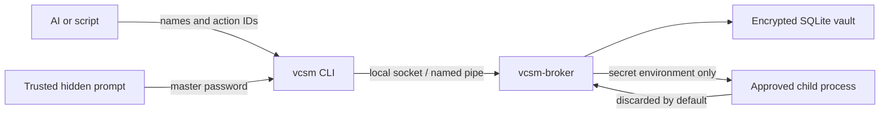

# VCSM

VCSM is a local, protected secret broker for AI-assisted development. The AI can create, rotate, check, and use named secrets through approved actions, but the API never provides a `get secret value` operation.

The broker is a native per-user process. It is not a Docker container. Docker can be an approved execution target, just like `npm`, `go`, or `python`.

## Implemented protected-mode boundary



- A user-selected master password is processed with Argon2id and a random salt. It wraps a random 256-bit data-encryption key; the password is not stored.
- Secret values and encrypted metadata use XChaCha20-Poly1305 with separate derived keys and authenticated context.
- Names are looked up through keyed HMAC tokens, so plaintext names are not database indexes.
- The local IPC endpoint is a mode-`0600` Unix socket on macOS/Linux and a per-user named pipe on Windows.
- Unlock lasts until manual lock or broker/process restart. Screen lock and display sleep do not lock the vault.
- While unlocked, VCSM prevents idle system sleep but allows display sleep, so long-running AI jobs continue.
- New secrets are generated inside the broker and encrypted immediately. Generation profiles avoid shell-hostile characters and provide more than 200 bits of entropy.
- Actions are configured by the user and re-approved with the master password. AI callers can run an action by name but cannot submit an arbitrary executable.
- Child output is discarded by default. A user may approve `redacted` output; exact secret values are then removed across write boundaries. This is convenience, not protection against malicious encoding or exfiltration.
- Audit events contain operation, object ID, result, time, and exit code only, and are HMAC chained.

There is intentionally no secret-value read, export, clipboard, or response operation.

## Build and install

Go 1.24 or newer is required.

macOS or Linux:

```sh
./scripts/install.sh
vcsm init
vcsm unlock
```

Windows PowerShell:

```powershell
./scripts/install.ps1
vcsm init
vcsm unlock
```

The installer builds `vcsm` and `vcsm-broker`, then registers the broker as a per-user login service. It does not install Docker or a database server.

For local development:

```sh
go build ./cmd/vcsm ./cmd/vcsm-broker
go test ./...
```

## Minimal workflow

Create a generated secret; its value is never printed:

```sh
vcsm secret create sample-web dev database-password --profile database
```

Approve a named action. The prompt is interactive and refuses passwords from pipes, arguments, or environment variables. Password-manager auto-type can fill the hidden field.

```sh
vcsm action configure sample-web dev migrate \
  --cwd "$HOME/Projects/sample-web" \
  --secret DATABASE_PASSWORD=database-password \
  --output metadata \
  -- npm run migrate
```

AI tools may then run only the approved name:

```sh
vcsm run sample-web dev migrate
```

Other operations:

```sh
vcsm status
vcsm secret list sample-web dev
vcsm secret rotate sample-web dev database-password --profile database
vcsm secret revoke sample-web dev database-password
vcsm action list sample-web dev
vcsm audit 50
vcsm lock
```

## Current scope

Biometric/keychain unlock and a graphical trusted UI are extension points, not part of this first vertical slice. The master-password prompt already supports password-manager auto-type without putting the password in AI-visible arguments, files, or environment variables.

See [docs/protected-architecture.md](docs/protected-architecture.md) for component boundaries and the remaining gaps.
