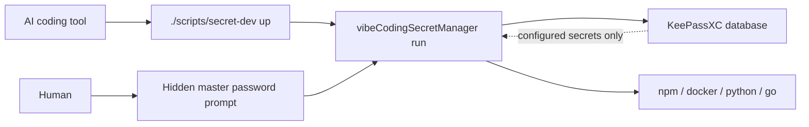

# vibeCodingSecretManager

Run local development commands with real secrets without putting `.env` files in your repository.

`vibeCodingSecretManager` is a small KeePassXC-backed CLI for developers who work with AI coding tools such as Claude Code, Codex, Cursor, and similar local agents. The agent can run approved project commands, but it does not get to read, print, copy, or manage secret values.

Secrets stay in KeePassXC. The human unlocks KeePassXC through a hidden terminal prompt. The runner injects only configured secrets into the child process environment.

## Why

AI coding tools are useful precisely because they can inspect and edit your project. That also makes repo-local secret files risky.

Avoid this:

```text
repo/.env
repo/.env.local
repo/docker/.env
```

Prefer this:

```text
~/.config/vibeCodingSecretManager/config.yaml
~/KeePass/example-dev.kdbx
~/KeePass/example-dev.key
repo/.env.example
repo/scripts/secret-dev
```

The repository contains placeholders and wrappers. KeePassXC contains the real values.

## How It Works



The important boundary is simple: the AI can trigger the wrapper, but the human unlocks KeePassXC.

## Install In An App Repo

From the application repository you want to protect:

```bash
VCSM_REPO_URL=https://github.com/Yaling7788/vibeCodingSecretManager.git \
VCSM_PROJECT=sample-webapp \
VCSM_ENV=dev \
VCSM_SECRETS=DATABASE_URL,OPENAI_API_KEY \
sh -c "$(curl -fsSL https://raw.githubusercontent.com/Yaling7788/vibeCodingSecretManager/main/scripts/install.sh)"
```

The bootstrap creates:

- a local `vibeCodingSecretManager` CLI install
- KeePassXC when `keepassxc-cli` is missing and a supported package manager is available
- `./scripts/secret-dev`
- `.env.example`
- `.gitignore` secret ignores
- `CLAUDE.md` if missing
- `~/.config/vibeCodingSecretManager/config.yaml` if missing

Customize the command with:

```bash
VCSM_PROJECT=my-app
VCSM_ENV=dev
VCSM_SECRETS=DATABASE_URL,OPENAI_API_KEY,RESEND_API_KEY
VCSM_DATABASE=~/KeePass/my-dev.kdbx
VCSM_KEY_FILE=~/KeePass/my-dev.key
VCSM_CLI_PATH=/Applications/KeePassXC.app/Contents/MacOS/keepassxc-cli
VCSM_INSTALL_KEEPASSXC=0
```

`VCSM_INSTALL_KEEPASSXC=0` skips KeePassXC installation.

KeePassXC auto-install support:

- macOS: Homebrew cask
- Debian/Ubuntu: `apt-get`
- Fedora/RHEL-style systems: `dnf` or `yum`
- Arch: `pacman`
- openSUSE: `zypper`
- Alpine: `apk`
- Nix: `nix profile`
- Windows shell environments: `winget`, `choco`, or `scoop`

If no supported package manager is found, the installer stops and tells the user how to install KeePassXC manually. Use `VCSM_CLI_PATH=/path/to/keepassxc-cli` when KeePassXC is installed in a custom location.

## Paste Into An AI Coding Tool

Give your coding agent this repository URL:

```text
https://github.com/Yaling7788/vibeCodingSecretManager
```

Then paste:

```text
Install vibeCodingSecretManager in this app repo using KeePassXC.

Use the repository's AI install guide:
docs/ai-coding-tool-install.md

Set up the wrapper, placeholder .env.example, .gitignore entries, and AI safety rules. Do not ask me for real secret values. Do not read, print, inspect, infer, retrieve, summarize, copy, or manage real secret values. If a value is needed, tell me to enter it into KeePassXC or into a local hidden prompt.
```

More detailed agent instructions live in [docs/ai-coding-tool-install.md](docs/ai-coding-tool-install.md).

## CLI Install Only

If you only want the CLI:

```bash
go install github.com/Yaling7788/vibeCodingSecretManager/cmd/vibeCodingSecretManager@latest
```

For local development inside this repo:

```bash
go build ./cmd/vibeCodingSecretManager
go test ./...
```

## Configuration

Default config path:

```text
~/.config/vibeCodingSecretManager/config.yaml
```

Example:

```yaml
vault:
  type: keepassxc
  database: ~/KeePass/example-dev.kdbx
  key_file: ~/KeePass/example-dev.key
  cli_path: auto

projects:
  sample-webapp:
    root: ~/Projects/sample-webapp
    environments:
      dev:
        secrets:
          DATABASE_URL: SampleWebApp/Dev/DATABASE_URL
          OPENAI_API_KEY: SampleWebApp/Dev/OPENAI_API_KEY
          RESEND_API_KEY: SampleWebApp/Dev/RESEND_API_KEY
```

Create matching KeePassXC entries and store each real value in the entry Password field.

Recommended naming:

```text
<Project>/<Environment>/<VARIABLE_NAME>
```

Example:

```text
SampleWebApp/Dev/DATABASE_URL
SampleWebApp/Dev/OPENAI_API_KEY
SampleWebApp/Dev/RESEND_API_KEY
```

## Usage

List configured variable names and KeePassXC entry paths:

```bash
vibeCodingSecretManager list sample-webapp dev
```

Check that configured entries exist:

```bash
vibeCodingSecretManager check sample-webapp dev
```

Run a command with secrets injected into the child process:

```bash
vibeCodingSecretManager run sample-webapp dev -- npm run dev
```

Run Docker Compose:

```bash
vibeCodingSecretManager run sample-webapp dev -- docker compose up
```

Use `--config path` before the command to load a non-default config file.

## App Wrapper

The bootstrap creates `./scripts/secret-dev`. A typical wrapper looks like this:

```bash
#!/bin/sh
set -eu

COMMAND="${1:-}"

case "$COMMAND" in
  up)
    exec vibeCodingSecretManager run sample-webapp dev -- npm run dev
    ;;
  docker)
    exec vibeCodingSecretManager run sample-webapp dev -- docker compose up
    ;;
  build)
    exec vibeCodingSecretManager run sample-webapp dev -- npm run build
    ;;
  test)
    exec npm test
    ;;
  lint)
    exec npm run lint
    ;;
  check-secrets)
    exec vibeCodingSecretManager check sample-webapp dev
    ;;
  list-secrets)
    exec vibeCodingSecretManager list sample-webapp dev
    ;;
  *)
    echo "Usage: ./scripts/secret-dev {up|docker|build|test|lint|check-secrets|list-secrets}"
    exit 1
    ;;
esac
```

Allow the agent to run wrapper commands such as:

```bash
./scripts/secret-dev up
./scripts/secret-dev check-secrets
./scripts/secret-dev list-secrets
```

Do not allow the agent to run `keepassxc-cli`, `printenv`, `env`, `set`, `export`, or commands that read `.env` files.

## Security Model

Protects against:

- Accidental `.env` reads by AI coding tools.
- Accidental commits of local secret files.
- Secret values being stored in repo files.
- Casual terminal output leaks from secret retrieval.

Does not protect against:

- Malicious code intentionally printing environment variables.
- An AI tool with unrestricted shell access.
- A compromised local machine.
- Production secrets used in local dev.
- Secrets leaked by the application itself.

Use development and test credentials. Rotate anything exposed.

## Master Password Policy

The KeePassXC master password is a human presence check.

Do:

- Type the master password into the local hidden prompt.
- Use an optional KeePassXC key file as an extra factor.
- Keep the database and key file outside the repo.

Do not:

- Store the master password in a file.
- Put it in environment variables.
- Put it in shell history or command arguments.
- Let an AI coding tool manage it.
- Run a headless unlock flow controlled by the AI.

If the AI can unlock KeePassXC without you, it can retrieve the vault contents. That breaks this tool's security model.

## Documentation

- [AI coding tool install](docs/ai-coding-tool-install.md)
- [KeePassXC setup](docs/keepassxc-setup.md)
- [Claude Code setup](docs/claude-code-setup.md)
- [Threat model](docs/threat-model.md)
- [Examples](docs/examples.md)
- [Agent skill](skills/manage-local-secrets/SKILL.md)
